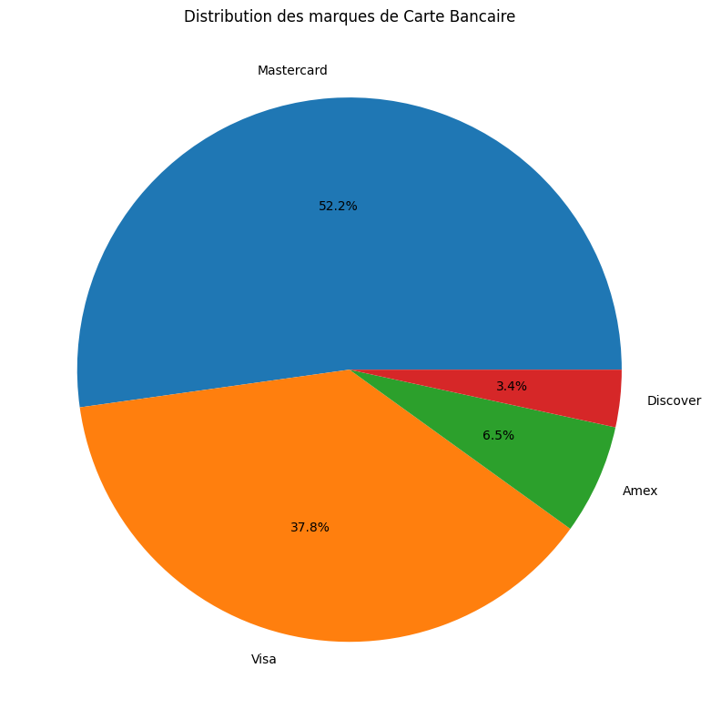
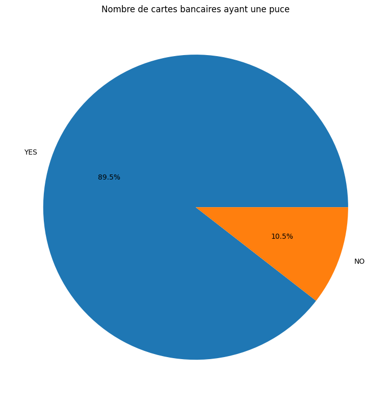
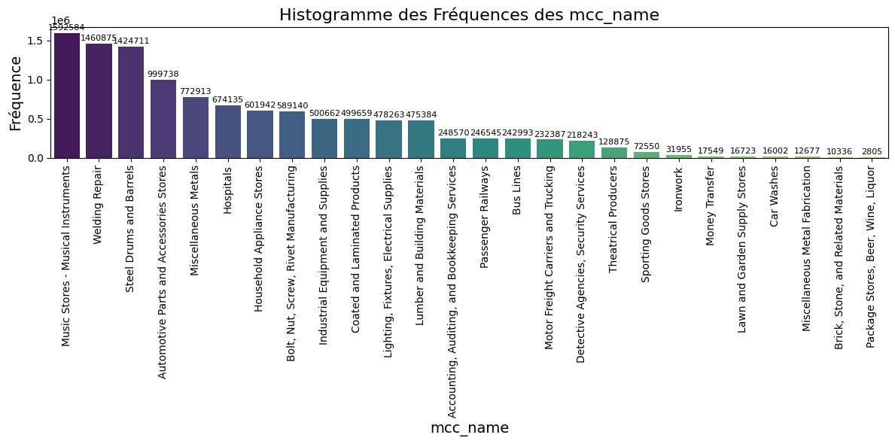

Financial Transactions Dataset: Analytics
=========================================

Import
------

.. code:: ipython3

    import pandas as pd
    import numpy as np
    import re
    import matplotlib.pyplot as plt
    import seaborn as sns
    import skimpy 
    from skimpy import skim
    import plotly.express as px
    import json

Création du DataFrame de base
-----------------------------

.. code:: ipython3

    users_data = pd.read_csv("users_data.csv", sep=",", low_memory=False)

.. code:: ipython3

    users_data.rename(columns={'id': 'client_id'}, inplace=True)

.. code:: ipython3

    users_data.head(5)

.. raw:: html

    

    
    <table border="1" class="dataframe">
      <thead>
        <tr style="text-align: right;">
          <th></th>
          <th>client_id</th>
          <th>current_age</th>
          <th>retirement_age</th>
          <th>birth_year</th>
          <th>birth_month</th>
          <th>gender</th>
          <th>address</th>
          <th>latitude</th>
          <th>longitude</th>
          <th>per_capita_income</th>
          <th>yearly_income</th>
          <th>total_debt</th>
          <th>credit_score</th>
          <th>num_credit_cards</th>
        </tr>
      </thead>
      <tbody>
        <tr>
          <th>0</th>
          <td>825</td>
          <td>53</td>
          <td>66</td>
          <td>1966</td>
          <td>11</td>
          <td>Female</td>
          <td>462 Rose Lane</td>
          <td>34.15</td>
          <td>-117.76</td>
          <td>$29278</td>
          <td>$59696</td>
          <td>$127613</td>
          <td>787</td>
          <td>5</td>
        </tr>
        <tr>
          <th>1</th>
          <td>1746</td>
          <td>53</td>
          <td>68</td>
          <td>1966</td>
          <td>12</td>
          <td>Female</td>
          <td>3606 Federal Boulevard</td>
          <td>40.76</td>
          <td>-73.74</td>
          <td>$37891</td>
          <td>$77254</td>
          <td>$191349</td>
          <td>701</td>
          <td>5</td>
        </tr>
        <tr>
          <th>2</th>
          <td>1718</td>
          <td>81</td>
          <td>67</td>
          <td>1938</td>
          <td>11</td>
          <td>Female</td>
          <td>766 Third Drive</td>
          <td>34.02</td>
          <td>-117.89</td>
          <td>$22681</td>
          <td>$33483</td>
          <td>$196</td>
          <td>698</td>
          <td>5</td>
        </tr>
        <tr>
          <th>3</th>
          <td>708</td>
          <td>63</td>
          <td>63</td>
          <td>1957</td>
          <td>1</td>
          <td>Female</td>
          <td>3 Madison Street</td>
          <td>40.71</td>
          <td>-73.99</td>
          <td>$163145</td>
          <td>$249925</td>
          <td>$202328</td>
          <td>722</td>
          <td>4</td>
        </tr>
        <tr>
          <th>4</th>
          <td>1164</td>
          <td>43</td>
          <td>70</td>
          <td>1976</td>
          <td>9</td>
          <td>Male</td>
          <td>9620 Valley Stream Drive</td>
          <td>37.76</td>
          <td>-122.44</td>
          <td>$53797</td>
          <td>$109687</td>
          <td>$183855</td>
          <td>675</td>
          <td>1</td>
        </tr>
      </tbody>
    </table>
    

.. code:: ipython3

    transactions_data = pd.read_csv("transactions_data.csv", sep=",", low_memory=False)

.. code:: ipython3

    transactions_data.rename(columns={'id': 'transaction_id'}, inplace=True)

.. code:: ipython3

    transactions_data.head(5)

.. raw:: html

    

    
    <table border="1" class="dataframe">
      <thead>
        <tr style="text-align: right;">
          <th></th>
          <th>transaction_id</th>
          <th>date</th>
          <th>client_id</th>
          <th>card_id</th>
          <th>amount</th>
          <th>use_chip</th>
          <th>merchant_id</th>
          <th>merchant_city</th>
          <th>merchant_state</th>
          <th>zip</th>
          <th>mcc</th>
          <th>errors</th>
        </tr>
      </thead>
      <tbody>
        <tr>
          <th>0</th>
          <td>7475327</td>
          <td>2010-01-01 00:01:00</td>
          <td>1556</td>
          <td>2972</td>
          <td>$-77.00</td>
          <td>Swipe Transaction</td>
          <td>59935</td>
          <td>Beulah</td>
          <td>ND</td>
          <td>58523.0</td>
          <td>5499</td>
          <td>NaN</td>
        </tr>
        <tr>
          <th>1</th>
          <td>7475328</td>
          <td>2010-01-01 00:02:00</td>
          <td>561</td>
          <td>4575</td>
          <td>$14.57</td>
          <td>Swipe Transaction</td>
          <td>67570</td>
          <td>Bettendorf</td>
          <td>IA</td>
          <td>52722.0</td>
          <td>5311</td>
          <td>NaN</td>
        </tr>
        <tr>
          <th>2</th>
          <td>7475329</td>
          <td>2010-01-01 00:02:00</td>
          <td>1129</td>
          <td>102</td>
          <td>$80.00</td>
          <td>Swipe Transaction</td>
          <td>27092</td>
          <td>Vista</td>
          <td>CA</td>
          <td>92084.0</td>
          <td>4829</td>
          <td>NaN</td>
        </tr>
        <tr>
          <th>3</th>
          <td>7475331</td>
          <td>2010-01-01 00:05:00</td>
          <td>430</td>
          <td>2860</td>
          <td>$200.00</td>
          <td>Swipe Transaction</td>
          <td>27092</td>
          <td>Crown Point</td>
          <td>IN</td>
          <td>46307.0</td>
          <td>4829</td>
          <td>NaN</td>
        </tr>
        <tr>
          <th>4</th>
          <td>7475332</td>
          <td>2010-01-01 00:06:00</td>
          <td>848</td>
          <td>3915</td>
          <td>$46.41</td>
          <td>Swipe Transaction</td>
          <td>13051</td>
          <td>Harwood</td>
          <td>MD</td>
          <td>20776.0</td>
          <td>5813</td>
          <td>NaN</td>
        </tr>
      </tbody>
    </table>
    

.. code:: ipython3

    cards_data =  pd.read_csv("cards_data.csv", sep=",", low_memory=False)

.. code:: ipython3

    cards_data.rename(columns={'id': 'card_id'}, inplace=True)

.. code:: ipython3

    cards_data.head(5)

.. raw:: html

    

    
    <table border="1" class="dataframe">
      <thead>
        <tr style="text-align: right;">
          <th></th>
          <th>card_id</th>
          <th>client_id</th>
          <th>card_brand</th>
          <th>card_type</th>
          <th>card_number</th>
          <th>expires</th>
          <th>cvv</th>
          <th>has_chip</th>
          <th>num_cards_issued</th>
          <th>credit_limit</th>
          <th>acct_open_date</th>
          <th>year_pin_last_changed</th>
          <th>card_on_dark_web</th>
        </tr>
      </thead>
      <tbody>
        <tr>
          <th>0</th>
          <td>4524</td>
          <td>825</td>
          <td>Visa</td>
          <td>Debit</td>
          <td>4344676511950444</td>
          <td>12/2022</td>
          <td>623</td>
          <td>YES</td>
          <td>2</td>
          <td>$24295</td>
          <td>09/2002</td>
          <td>2008</td>
          <td>No</td>
        </tr>
        <tr>
          <th>1</th>
          <td>2731</td>
          <td>825</td>
          <td>Visa</td>
          <td>Debit</td>
          <td>4956965974959986</td>
          <td>12/2020</td>
          <td>393</td>
          <td>YES</td>
          <td>2</td>
          <td>$21968</td>
          <td>04/2014</td>
          <td>2014</td>
          <td>No</td>
        </tr>
        <tr>
          <th>2</th>
          <td>3701</td>
          <td>825</td>
          <td>Visa</td>
          <td>Debit</td>
          <td>4582313478255491</td>
          <td>02/2024</td>
          <td>719</td>
          <td>YES</td>
          <td>2</td>
          <td>$46414</td>
          <td>07/2003</td>
          <td>2004</td>
          <td>No</td>
        </tr>
        <tr>
          <th>3</th>
          <td>42</td>
          <td>825</td>
          <td>Visa</td>
          <td>Credit</td>
          <td>4879494103069057</td>
          <td>08/2024</td>
          <td>693</td>
          <td>NO</td>
          <td>1</td>
          <td>$12400</td>
          <td>01/2003</td>
          <td>2012</td>
          <td>No</td>
        </tr>
        <tr>
          <th>4</th>
          <td>4659</td>
          <td>825</td>
          <td>Mastercard</td>
          <td>Debit (Prepaid)</td>
          <td>5722874738736011</td>
          <td>03/2009</td>
          <td>75</td>
          <td>YES</td>
          <td>1</td>
          <td>$28</td>
          <td>09/2008</td>
          <td>2009</td>
          <td>No</td>
        </tr>
      </tbody>
    </table>
    

.. code:: ipython3

    #Reading the JSON files
    with open('mcc_codes.json', 'r') as file:
        codes = json.load(file)
    
    with open('train_fraud_labels.json', 'r') as file:
        fraud = json.load(file)

.. code:: ipython3

    fraud_id = list(fraud['target'].keys())
    fraud_status = list(fraud['target'].values())
    
    df_fraud = pd.DataFrame({"fraud_id": fraud_id, 'Status': fraud_status})
    df_fraud.head(3)

.. raw:: html

    

    
    <table border="1" class="dataframe">
      <thead>
        <tr style="text-align: right;">
          <th></th>
          <th>fraud_id</th>
          <th>Status</th>
        </tr>
      </thead>
      <tbody>
        <tr>
          <th>0</th>
          <td>10649266</td>
          <td>No</td>
        </tr>
        <tr>
          <th>1</th>
          <td>23410063</td>
          <td>No</td>
        </tr>
        <tr>
          <th>2</th>
          <td>9316588</td>
          <td>No</td>
        </tr>
      </tbody>
    </table>
    

.. code:: ipython3

    code = list(codes.keys())
    name = list(codes.values())
    
    df_code = pd.DataFrame({'mcc': code, 'Name': name})
    df_code.head(3)

.. raw:: html

    

    
    <table border="1" class="dataframe">
      <thead>
        <tr style="text-align: right;">
          <th></th>
          <th>mcc</th>
          <th>Name</th>
        </tr>
      </thead>
      <tbody>
        <tr>
          <th>0</th>
          <td>5812</td>
          <td>Eating Places and Restaurants</td>
        </tr>
        <tr>
          <th>1</th>
          <td>5541</td>
          <td>Service Stations</td>
        </tr>
        <tr>
          <th>2</th>
          <td>7996</td>
          <td>Amusement Parks, Carnivals, Circuses</td>
        </tr>
      </tbody>
    </table>
    

.. code:: ipython3

    # Fusionner users_data et cards_data sur la colonne 'user_id'
    merged_data = pd.merge(users_data, cards_data, on='client_id')

.. code:: ipython3

    merged_data.head(5)

.. raw:: html

    

    
    <table border="1" class="dataframe">
      <thead>
        <tr style="text-align: right;">
          <th></th>
          <th>client_id</th>
          <th>current_age</th>
          <th>retirement_age</th>
          <th>birth_year</th>
          <th>birth_month</th>
          <th>gender</th>
          <th>address</th>
          <th>latitude</th>
          <th>longitude</th>
          <th>per_capita_income</th>
          <th>...</th>
          <th>card_type</th>
          <th>card_number</th>
          <th>expires</th>
          <th>cvv</th>
          <th>has_chip</th>
          <th>num_cards_issued</th>
          <th>credit_limit</th>
          <th>acct_open_date</th>
          <th>year_pin_last_changed</th>
          <th>card_on_dark_web</th>
        </tr>
      </thead>
      <tbody>
        <tr>
          <th>0</th>
          <td>825</td>
          <td>53</td>
          <td>66</td>
          <td>1966</td>
          <td>11</td>
          <td>Female</td>
          <td>462 Rose Lane</td>
          <td>34.15</td>
          <td>-117.76</td>
          <td>$29278</td>
          <td>...</td>
          <td>Debit</td>
          <td>4344676511950444</td>
          <td>12/2022</td>
          <td>623</td>
          <td>YES</td>
          <td>2</td>
          <td>$24295</td>
          <td>09/2002</td>
          <td>2008</td>
          <td>No</td>
        </tr>
        <tr>
          <th>1</th>
          <td>825</td>
          <td>53</td>
          <td>66</td>
          <td>1966</td>
          <td>11</td>
          <td>Female</td>
          <td>462 Rose Lane</td>
          <td>34.15</td>
          <td>-117.76</td>
          <td>$29278</td>
          <td>...</td>
          <td>Debit</td>
          <td>4956965974959986</td>
          <td>12/2020</td>
          <td>393</td>
          <td>YES</td>
          <td>2</td>
          <td>$21968</td>
          <td>04/2014</td>
          <td>2014</td>
          <td>No</td>
        </tr>
        <tr>
          <th>2</th>
          <td>825</td>
          <td>53</td>
          <td>66</td>
          <td>1966</td>
          <td>11</td>
          <td>Female</td>
          <td>462 Rose Lane</td>
          <td>34.15</td>
          <td>-117.76</td>
          <td>$29278</td>
          <td>...</td>
          <td>Debit</td>
          <td>4582313478255491</td>
          <td>02/2024</td>
          <td>719</td>
          <td>YES</td>
          <td>2</td>
          <td>$46414</td>
          <td>07/2003</td>
          <td>2004</td>
          <td>No</td>
        </tr>
        <tr>
          <th>3</th>
          <td>825</td>
          <td>53</td>
          <td>66</td>
          <td>1966</td>
          <td>11</td>
          <td>Female</td>
          <td>462 Rose Lane</td>
          <td>34.15</td>
          <td>-117.76</td>
          <td>$29278</td>
          <td>...</td>
          <td>Credit</td>
          <td>4879494103069057</td>
          <td>08/2024</td>
          <td>693</td>
          <td>NO</td>
          <td>1</td>
          <td>$12400</td>
          <td>01/2003</td>
          <td>2012</td>
          <td>No</td>
        </tr>
        <tr>
          <th>4</th>
          <td>825</td>
          <td>53</td>
          <td>66</td>
          <td>1966</td>
          <td>11</td>
          <td>Female</td>
          <td>462 Rose Lane</td>
          <td>34.15</td>
          <td>-117.76</td>
          <td>$29278</td>
          <td>...</td>
          <td>Debit (Prepaid)</td>
          <td>5722874738736011</td>
          <td>03/2009</td>
          <td>75</td>
          <td>YES</td>
          <td>1</td>
          <td>$28</td>
          <td>09/2008</td>
          <td>2009</td>
          <td>No</td>
        </tr>
      </tbody>
    </table>
    
5 rows × 26 columns

    

.. code:: ipython3

    transactions_data.shape

.. parsed-literal::

    (13305915, 12)

.. code:: ipython3

    transactions_data.info()

.. parsed-literal::

    <class 'pandas.core.frame.DataFrame'>
    RangeIndex: 13305915 entries, 0 to 13305914
    Data columns (total 12 columns):
     #   Column          Dtype  
    ---  ------          -----  
     0   transaction_id  int64  
     1   date            object 
     2   client_id       int64  
     3   card_id         int64  
     4   amount          object 
     5   use_chip        object 
     6   merchant_id     int64  
     7   merchant_city   object 
     8   merchant_state  object 
     9   zip             float64
     10  mcc             int64  
     11  errors          object 
    dtypes: float64(1), int64(5), object(6)
    memory usage: 1.2+ GB

.. code:: ipython3

    merged_data.shape

.. parsed-literal::

    (6146, 26)

.. code:: ipython3

    merged_data.info()

.. parsed-literal::

    <class 'pandas.core.frame.DataFrame'>
    RangeIndex: 6146 entries, 0 to 6145
    Data columns (total 26 columns):
     #   Column                 Non-Null Count  Dtype  
    ---  ------                 --------------  -----  
     0   client_id              6146 non-null   int64  
     1   current_age            6146 non-null   int64  
     2   retirement_age         6146 non-null   int64  
     3   birth_year             6146 non-null   int64  
     4   birth_month            6146 non-null   int64  
     5   gender                 6146 non-null   object 
     6   address                6146 non-null   object 
     7   latitude               6146 non-null   float64
     8   longitude              6146 non-null   float64
     9   per_capita_income      6146 non-null   object 
     10  yearly_income          6146 non-null   object 
     11  total_debt             6146 non-null   object 
     12  credit_score           6146 non-null   int64  
     13  num_credit_cards       6146 non-null   int64  
     14  card_id                6146 non-null   int64  
     15  card_brand             6146 non-null   object 
     16  card_type              6146 non-null   object 
     17  card_number            6146 non-null   int64  
     18  expires                6146 non-null   object 
     19  cvv                    6146 non-null   int64  
     20  has_chip               6146 non-null   object 
     21  num_cards_issued       6146 non-null   int64  
     22  credit_limit           6146 non-null   object 
     23  acct_open_date         6146 non-null   object 
     24  year_pin_last_changed  6146 non-null   int64  
     25  card_on_dark_web       6146 non-null   object 
    dtypes: float64(2), int64(12), object(12)
    memory usage: 1.2+ MB

.. code:: ipython3

    transactions_data.describe(include="object").T

.. raw:: html

    

    
    <table border="1" class="dataframe">
      <thead>
        <tr style="text-align: right;">
          <th></th>
          <th>count</th>
          <th>unique</th>
          <th>top</th>
          <th>freq</th>
        </tr>
      </thead>
      <tbody>
        <tr>
          <th>date</th>
          <td>13305915</td>
          <td>4136496</td>
          <td>2016-03-03 11:42:00</td>
          <td>18</td>
        </tr>
        <tr>
          <th>amount</th>
          <td>13305915</td>
          <td>81161</td>
          <td>$80.00</td>
          <td>132115</td>
        </tr>
        <tr>
          <th>use_chip</th>
          <td>13305915</td>
          <td>3</td>
          <td>Swipe Transaction</td>
          <td>6967185</td>
        </tr>
        <tr>
          <th>merchant_city</th>
          <td>13305915</td>
          <td>12492</td>
          <td>ONLINE</td>
          <td>1563700</td>
        </tr>
        <tr>
          <th>merchant_state</th>
          <td>11742215</td>
          <td>199</td>
          <td>CA</td>
          <td>1427087</td>
        </tr>
        <tr>
          <th>errors</th>
          <td>211393</td>
          <td>22</td>
          <td>Insufficient Balance</td>
          <td>130902</td>
        </tr>
      </tbody>
    </table>
    

.. code:: ipython3

    merged_data.describe(include="object").T

.. raw:: html

    

    
    <table border="1" class="dataframe">
      <thead>
        <tr style="text-align: right;">
          <th></th>
          <th>count</th>
          <th>unique</th>
          <th>top</th>
          <th>freq</th>
        </tr>
      </thead>
      <tbody>
        <tr>
          <th>gender</th>
          <td>6146</td>
          <td>2</td>
          <td>Female</td>
          <td>3139</td>
        </tr>
        <tr>
          <th>address</th>
          <td>6146</td>
          <td>1999</td>
          <td>7945 Fourth Avenue</td>
          <td>9</td>
        </tr>
        <tr>
          <th>per_capita_income</th>
          <td>6146</td>
          <td>1754</td>
          <td>$0</td>
          <td>41</td>
        </tr>
        <tr>
          <th>yearly_income</th>
          <td>6146</td>
          <td>1948</td>
          <td>$48750</td>
          <td>13</td>
        </tr>
        <tr>
          <th>total_debt</th>
          <td>6146</td>
          <td>1880</td>
          <td>$0</td>
          <td>365</td>
        </tr>
        <tr>
          <th>card_brand</th>
          <td>6146</td>
          <td>4</td>
          <td>Mastercard</td>
          <td>3209</td>
        </tr>
        <tr>
          <th>card_type</th>
          <td>6146</td>
          <td>3</td>
          <td>Debit</td>
          <td>3511</td>
        </tr>
        <tr>
          <th>expires</th>
          <td>6146</td>
          <td>259</td>
          <td>02/2020</td>
          <td>377</td>
        </tr>
        <tr>
          <th>has_chip</th>
          <td>6146</td>
          <td>2</td>
          <td>YES</td>
          <td>5500</td>
        </tr>
        <tr>
          <th>credit_limit</th>
          <td>6146</td>
          <td>3654</td>
          <td>$0</td>
          <td>31</td>
        </tr>
        <tr>
          <th>acct_open_date</th>
          <td>6146</td>
          <td>303</td>
          <td>02/2020</td>
          <td>607</td>
        </tr>
        <tr>
          <th>card_on_dark_web</th>
          <td>6146</td>
          <td>1</td>
          <td>No</td>
          <td>6146</td>
        </tr>
      </tbody>
    </table>
    

.. code:: ipython3

    # Calculer le taux de remplissage pour chaque colonne
    column_fill_rates = merged_data.notna().mean() * 100
    
    # Afficher le taux de remplissage pour chaque colonne
    column_fill_rates

.. parsed-literal::

    client_id                100.0
    current_age              100.0
    retirement_age           100.0
    birth_year               100.0
    birth_month              100.0
    gender                   100.0
    address                  100.0
    latitude                 100.0
    longitude                100.0
    per_capita_income        100.0
    yearly_income            100.0
    total_debt               100.0
    credit_score             100.0
    num_credit_cards         100.0
    card_id                  100.0
    card_brand               100.0
    card_type                100.0
    card_number              100.0
    expires                  100.0
    cvv                      100.0
    has_chip                 100.0
    num_cards_issued         100.0
    credit_limit             100.0
    acct_open_date           100.0
    year_pin_last_changed    100.0
    card_on_dark_web         100.0
    dtype: float64

.. code:: ipython3

    # Calculer le taux de remplissage pour chaque colonne
    column_fill_rates = transactions_data.notna().mean() * 100
    
    # Afficher le taux de remplissage pour chaque colonne
    column_fill_rates

.. parsed-literal::

    transaction_id    100.000000
    date              100.000000
    client_id         100.000000
    card_id           100.000000
    amount            100.000000
    use_chip          100.000000
    merchant_id       100.000000
    merchant_city     100.000000
    merchant_state     88.248084
    zip                87.579163
    mcc               100.000000
    errors              1.588714
    dtype: float64

.. code:: ipython3

    transactions_data.isnull().sum()

.. parsed-literal::

    transaction_id           0
    date                     0
    client_id                0
    card_id                  0
    amount                   0
    use_chip                 0
    merchant_id              0
    merchant_city            0
    merchant_state     1563700
    zip                1652706
    mcc                      0
    errors            13094522
    dtype: int64

Type de carte
-------------

.. code:: ipython3

    card_brand=merged_data['card_brand'].value_counts().reset_index()
    card_brand

.. raw:: html

    

    
    <table border="1" class="dataframe">
      <thead>
        <tr style="text-align: right;">
          <th></th>
          <th>card_brand</th>
          <th>count</th>
        </tr>
      </thead>
      <tbody>
        <tr>
          <th>0</th>
          <td>Mastercard</td>
          <td>3209</td>
        </tr>
        <tr>
          <th>1</th>
          <td>Visa</td>
          <td>2326</td>
        </tr>
        <tr>
          <th>2</th>
          <td>Amex</td>
          <td>402</td>
        </tr>
        <tr>
          <th>3</th>
          <td>Discover</td>
          <td>209</td>
        </tr>
      </tbody>
    </table>
    

.. code:: ipython3

    plt.figure(figsize=(20, 8))
    merged_data['card_brand'].value_counts().plot(kind='pie',autopct='%1.1f%%')
    plt.title('Distribution des marques de Carte Bancaire')
    plt.ylabel("")
    plt.tight_layout()
    plt.show()

On constate que **Mastecard** est la marque de CB la plus répandue.

.. code:: ipython3

    card_type=merged_data['card_type'].value_counts().reset_index()
    card_type

.. raw:: html

    

    
    <table border="1" class="dataframe">
      <thead>
        <tr style="text-align: right;">
          <th></th>
          <th>card_type</th>
          <th>count</th>
        </tr>
      </thead>
      <tbody>
        <tr>
          <th>0</th>
          <td>Debit</td>
          <td>3511</td>
        </tr>
        <tr>
          <th>1</th>
          <td>Credit</td>
          <td>2057</td>
        </tr>
        <tr>
          <th>2</th>
          <td>Debit (Prepaid)</td>
          <td>578</td>
        </tr>
      </tbody>
    </table>
    

.. code:: ipython3

    plt.figure(figsize=(20, 8))
    merged_data['card_type'].value_counts().plot(kind='pie',autopct='%1.1f%%')
    plt.title('Distribution des types de Carte Bancaire')
    plt.ylabel("")
    plt.tight_layout()
    plt.show()

.. image:: _static/images/output_32_0.jpg

On constate que la majorité des cartes sont des cartes de type **débit**

Les genres
----------

.. code:: ipython3

    merged_data['gender'].value_counts().reset_index()

.. raw:: html

    

    
    <table border="1" class="dataframe">
      <thead>
        <tr style="text-align: right;">
          <th></th>
          <th>gender</th>
          <th>count</th>
        </tr>
      </thead>
      <tbody>
        <tr>
          <th>0</th>
          <td>Female</td>
          <td>3139</td>
        </tr>
        <tr>
          <th>1</th>
          <td>Male</td>
          <td>3007</td>
        </tr>
      </tbody>
    </table>
    

On remarque qu’il y a un peu plus de femmes, mais la différence est
négligeable vis à vis du nombre de client

.. code:: ipython3

    card_gender = merged_data.groupby('card_brand')['gender'].value_counts()
    card_gender.sort_values(ascending=False)

.. parsed-literal::

    card_brand  gender
    Mastercard  Female    1651
                Male      1558
    Visa        Male      1174
                Female    1152
    Amex        Female     221
                Male       181
    Discover    Female     115
                Male        94
    Name: count, dtype: int64

.. code:: ipython3

    card_type_gender = merged_data.groupby('card_type')['gender'].value_counts()
    card_type_gender.sort_values(ascending=False)

.. parsed-literal::

    card_type        gender
    Debit            Female    1814
                     Male      1697
    Credit           Female    1043
                     Male      1014
    Debit (Prepaid)  Male       296
                     Female     282
    Name: count, dtype: int64

Utilisation sur le Dark web
---------------------------

.. code:: ipython3

    merged_data['card_on_dark_web'].value_counts().reset_index()

.. raw:: html

    

    
    <table border="1" class="dataframe">
      <thead>
        <tr style="text-align: right;">
          <th></th>
          <th>card_on_dark_web</th>
          <th>count</th>
        </tr>
      </thead>
      <tbody>
        <tr>
          <th>0</th>
          <td>No</td>
          <td>6146</td>
        </tr>
      </tbody>
    </table>
    

Aucun client n’utilise sa carte sur le Dark Web

.. code:: ipython3

    merged_data.columns

.. parsed-literal::

    Index(['client_id', 'current_age', 'retirement_age', 'birth_year',
           'birth_month', 'gender', 'address', 'latitude', 'longitude',
           'per_capita_income', 'yearly_income', 'total_debt', 'credit_score',
           'num_credit_cards', 'card_id', 'card_brand', 'card_type', 'card_number',
           'expires', 'cvv', 'has_chip', 'num_cards_issued', 'credit_limit',
           'acct_open_date', 'year_pin_last_changed', 'card_on_dark_web'],
          dtype='object')

Nombre de cartes par client
---------------------------

.. code:: ipython3

    merged_data['num_cards_issued'].value_counts().reset_index()

.. raw:: html

    

    
    <table border="1" class="dataframe">
      <thead>
        <tr style="text-align: right;">
          <th></th>
          <th>num_cards_issued</th>
          <th>count</th>
        </tr>
      </thead>
      <tbody>
        <tr>
          <th>0</th>
          <td>1</td>
          <td>3114</td>
        </tr>
        <tr>
          <th>1</th>
          <td>2</td>
          <td>2972</td>
        </tr>
        <tr>
          <th>2</th>
          <td>3</td>
          <td>60</td>
        </tr>
      </tbody>
    </table>
    

La majorité des gens ont une seule carte bancaire. Toutefois, le nombre
de client ayant 2 cartes reste assez élevé.

Nombre de cartes à puces
------------------------

.. code:: ipython3

    merged_data['has_chip'].value_counts().reset_index()

.. raw:: html

    

    
    <table border="1" class="dataframe">
      <thead>
        <tr style="text-align: right;">
          <th></th>
          <th>has_chip</th>
          <th>count</th>
        </tr>
      </thead>
      <tbody>
        <tr>
          <th>0</th>
          <td>YES</td>
          <td>5500</td>
        </tr>
        <tr>
          <th>1</th>
          <td>NO</td>
          <td>646</td>
        </tr>
      </tbody>
    </table>
    

.. code:: ipython3

    plt.figure(figsize=(20, 8))
    merged_data['has_chip'].value_counts().plot(kind='pie',autopct='%1.1f%%')
    plt.title('Nombre de cartes bancaires ayant une puce')
    plt.ylabel("")
    plt.tight_layout()
    plt.show()

Credit_score
------------

.. code:: ipython3

    merged_data['credit_score'].value_counts().reset_index()

.. raw:: html

    

    
    <table border="1" class="dataframe">
      <thead>
        <tr style="text-align: right;">
          <th></th>
          <th>credit_score</th>
          <th>count</th>
        </tr>
      </thead>
      <tbody>
        <tr>
          <th>0</th>
          <td>850</td>
          <td>113</td>
        </tr>
        <tr>
          <th>1</th>
          <td>689</td>
          <td>84</td>
        </tr>
        <tr>
          <th>2</th>
          <td>684</td>
          <td>74</td>
        </tr>
        <tr>
          <th>3</th>
          <td>698</td>
          <td>72</td>
        </tr>
        <tr>
          <th>4</th>
          <td>693</td>
          <td>71</td>
        </tr>
        <tr>
          <th>...</th>
          <td>...</td>
          <td>...</td>
        </tr>
        <tr>
          <th>316</th>
          <td>561</td>
          <td>1</td>
        </tr>
        <tr>
          <th>317</th>
          <td>510</td>
          <td>1</td>
        </tr>
        <tr>
          <th>318</th>
          <td>508</td>
          <td>1</td>
        </tr>
        <tr>
          <th>319</th>
          <td>571</td>
          <td>1</td>
        </tr>
        <tr>
          <th>320</th>
          <td>560</td>
          <td>1</td>
        </tr>
      </tbody>
    </table>
    
321 rows × 2 columns

    

.. code:: ipython3

    merged_data['total_debt'].value_counts().reset_index()

.. raw:: html

    

    
    <table border="1" class="dataframe">
      <thead>
        <tr style="text-align: right;">
          <th></th>
          <th>total_debt</th>
          <th>count</th>
        </tr>
      </thead>
      <tbody>
        <tr>
          <th>0</th>
          <td>$0</td>
          <td>365</td>
        </tr>
        <tr>
          <th>1</th>
          <td>$97188</td>
          <td>10</td>
        </tr>
        <tr>
          <th>2</th>
          <td>$21853</td>
          <td>9</td>
        </tr>
        <tr>
          <th>3</th>
          <td>$889</td>
          <td>9</td>
        </tr>
        <tr>
          <th>4</th>
          <td>$81158</td>
          <td>9</td>
        </tr>
        <tr>
          <th>...</th>
          <td>...</td>
          <td>...</td>
        </tr>
        <tr>
          <th>1875</th>
          <td>$108499</td>
          <td>1</td>
        </tr>
        <tr>
          <th>1876</th>
          <td>$38967</td>
          <td>1</td>
        </tr>
        <tr>
          <th>1877</th>
          <td>$68198</td>
          <td>1</td>
        </tr>
        <tr>
          <th>1878</th>
          <td>$46379</td>
          <td>1</td>
        </tr>
        <tr>
          <th>1879</th>
          <td>$76960</td>
          <td>1</td>
        </tr>
      </tbody>
    </table>
    
1880 rows × 2 columns

    

.. code:: ipython3

    # Créer un dictionnaire pour le mappage
    mcc_to_name = dict(zip(transactions_data['mcc'], df_code['Name']))
    
    # Utiliser .map() pour associer les noms correspondants aux mcc dans transactions_data
    transactions_data['mcc_name'] = transactions_data['mcc'].map(mcc_to_name)
    
    # Afficher les résultats
    transactions_data[['mcc', 'mcc_name']]

.. raw:: html

    

    
    <table border="1" class="dataframe">
      <thead>
        <tr style="text-align: right;">
          <th></th>
          <th>mcc</th>
          <th>mcc_name</th>
        </tr>
      </thead>
      <tbody>
        <tr>
          <th>0</th>
          <td>5499</td>
          <td>Welding Repair</td>
        </tr>
        <tr>
          <th>1</th>
          <td>5311</td>
          <td>Lumber and Building Materials</td>
        </tr>
        <tr>
          <th>2</th>
          <td>4829</td>
          <td>Bolt, Nut, Screw, Rivet Manufacturing</td>
        </tr>
        <tr>
          <th>3</th>
          <td>4829</td>
          <td>Bolt, Nut, Screw, Rivet Manufacturing</td>
        </tr>
        <tr>
          <th>4</th>
          <td>5813</td>
          <td>Accounting, Auditing, and Bookkeeping Services</td>
        </tr>
        <tr>
          <th>...</th>
          <td>...</td>
          <td>...</td>
        </tr>
        <tr>
          <th>13305910</th>
          <td>5499</td>
          <td>Welding Repair</td>
        </tr>
        <tr>
          <th>13305911</th>
          <td>5815</td>
          <td>NaN</td>
        </tr>
        <tr>
          <th>13305912</th>
          <td>4900</td>
          <td>Bus Lines</td>
        </tr>
        <tr>
          <th>13305913</th>
          <td>5411</td>
          <td>Music Stores - Musical Instruments</td>
        </tr>
        <tr>
          <th>13305914</th>
          <td>5921</td>
          <td>Theatrical Producers</td>
        </tr>
      </tbody>
    </table>
    
13305915 rows × 2 columns

    

.. code:: ipython3

    
    # Obtenir le comptage des valeurs de 'mcc_name'
    mcc_name_counts = transactions_data['mcc_name'].value_counts().reset_index()
    mcc_name_counts.columns = ['mcc_name', 'count']  # Renommer les colonnes pour plus de clarté
    
    # Créer l'histogramme avec hue
    plt.figure(figsize=(12, 6))
    
    # Créer le barplot
    ax = sns.barplot(x='mcc_name', y='count', data=mcc_name_counts, hue='mcc_name', dodge=False, palette='viridis', width=0.8)
    
    # Ajouter des titres et des étiquettes
    plt.title('Histogramme des Fréquences des mcc_name', fontsize=16)
    plt.xlabel('mcc_name', fontsize=14)
    plt.ylabel('Fréquence', fontsize=14)
    
    # Orientation des labels de l'axe X à 90°
    plt.xticks(rotation=90)
    
    # Ajouter les étiquettes au-dessus de chaque barre
    for p in ax.patches:
        ax.annotate(f'{int(p.get_height())}',  # Affiche la hauteur de la barre (comptage)
                    (p.get_x() + p.get_width() / 2., p.get_height()),  # Positionnement de l'étiquette
                    ha='center', va='center', fontsize=8, color='black',  # Alignement et couleur
                    xytext=(0, 5),  # Décalage de l'étiquette (légèrement au-dessus de la barre)
                    textcoords='offset points')
    
    # Ajuster l'affichage
    plt.tight_layout()
    
    # Afficher le graphique
    plt.show()

Clients à la retraite
---------------------

.. code:: ipython3

    retirement_client = merged_data[merged_data['current_age'] > merged_data['retirement_age']]
    retirement_client['current_age'].value_counts().reset_index()

.. raw:: html

    

    
    <table border="1" class="dataframe">
      <thead>
        <tr style="text-align: right;">
          <th></th>
          <th>current_age</th>
          <th>count</th>
        </tr>
      </thead>
      <tbody>
        <tr>
          <th>0</th>
          <td>83</td>
          <td>72</td>
        </tr>
        <tr>
          <th>1</th>
          <td>76</td>
          <td>61</td>
        </tr>
        <tr>
          <th>2</th>
          <td>78</td>
          <td>60</td>
        </tr>
        <tr>
          <th>3</th>
          <td>68</td>
          <td>58</td>
        </tr>
        <tr>
          <th>4</th>
          <td>81</td>
          <td>55</td>
        </tr>
        <tr>
          <th>5</th>
          <td>82</td>
          <td>55</td>
        </tr>
        <tr>
          <th>6</th>
          <td>75</td>
          <td>50</td>
        </tr>
        <tr>
          <th>7</th>
          <td>79</td>
          <td>45</td>
        </tr>
        <tr>
          <th>8</th>
          <td>77</td>
          <td>45</td>
        </tr>
        <tr>
          <th>9</th>
          <td>86</td>
          <td>43</td>
        </tr>
        <tr>
          <th>10</th>
          <td>74</td>
          <td>43</td>
        </tr>
        <tr>
          <th>11</th>
          <td>85</td>
          <td>42</td>
        </tr>
        <tr>
          <th>12</th>
          <td>73</td>
          <td>42</td>
        </tr>
        <tr>
          <th>13</th>
          <td>88</td>
          <td>39</td>
        </tr>
        <tr>
          <th>14</th>
          <td>70</td>
          <td>38</td>
        </tr>
        <tr>
          <th>15</th>
          <td>84</td>
          <td>38</td>
        </tr>
        <tr>
          <th>16</th>
          <td>67</td>
          <td>33</td>
        </tr>
        <tr>
          <th>17</th>
          <td>80</td>
          <td>29</td>
        </tr>
        <tr>
          <th>18</th>
          <td>87</td>
          <td>29</td>
        </tr>
        <tr>
          <th>19</th>
          <td>63</td>
          <td>29</td>
        </tr>
        <tr>
          <th>20</th>
          <td>72</td>
          <td>28</td>
        </tr>
        <tr>
          <th>21</th>
          <td>71</td>
          <td>27</td>
        </tr>
        <tr>
          <th>22</th>
          <td>90</td>
          <td>27</td>
        </tr>
        <tr>
          <th>23</th>
          <td>92</td>
          <td>27</td>
        </tr>
        <tr>
          <th>24</th>
          <td>66</td>
          <td>22</td>
        </tr>
        <tr>
          <th>25</th>
          <td>65</td>
          <td>22</td>
        </tr>
        <tr>
          <th>26</th>
          <td>91</td>
          <td>20</td>
        </tr>
        <tr>
          <th>27</th>
          <td>89</td>
          <td>19</td>
        </tr>
        <tr>
          <th>28</th>
          <td>61</td>
          <td>12</td>
        </tr>
        <tr>
          <th>29</th>
          <td>94</td>
          <td>12</td>
        </tr>
        <tr>
          <th>30</th>
          <td>98</td>
          <td>12</td>
        </tr>
        <tr>
          <th>31</th>
          <td>69</td>
          <td>12</td>
        </tr>
        <tr>
          <th>32</th>
          <td>64</td>
          <td>8</td>
        </tr>
        <tr>
          <th>33</th>
          <td>99</td>
          <td>8</td>
        </tr>
        <tr>
          <th>34</th>
          <td>93</td>
          <td>7</td>
        </tr>
        <tr>
          <th>35</th>
          <td>62</td>
          <td>7</td>
        </tr>
        <tr>
          <th>36</th>
          <td>60</td>
          <td>5</td>
        </tr>
        <tr>
          <th>37</th>
          <td>101</td>
          <td>4</td>
        </tr>
        <tr>
          <th>38</th>
          <td>57</td>
          <td>4</td>
        </tr>
        <tr>
          <th>39</th>
          <td>58</td>
          <td>4</td>
        </tr>
        <tr>
          <th>40</th>
          <td>59</td>
          <td>1</td>
        </tr>
      </tbody>
    </table>
    

.. code:: ipython3

    
    # Créer un graphique de distribution des âges des personnes à la retraite
    plt.figure(figsize=(10, 6))
    
    # Ajouter hue=current_age et désactiver la légende
    sns.countplot(
        x='current_age',
        data=retirement_client,
        hue='current_age',  # Utiliser current_age comme hue
        palette='viridis',
        dodge=False,  # Pour éviter les barres séparées
        legend=False
    )
    
    # Ajouter des titres et des labels
    plt.title("Distribution des âges des personnes à la retraite", fontsize=16)
    plt.xlabel("Âge actuel", fontsize=14)
    plt.ylabel("Nombre de personnes", fontsize=14)
    
    # Ajuster l'affichage des ticks
    plt.xticks(rotation=45)
    
    # Appliquer une mise en page optimisée
    plt.tight_layout()
    
    # Afficher le graphique
    plt.show()

.. image:: _static/images/output_56_0.jpg

.. code:: ipython3

    
    # Calculer le nombre de personnes à la retraite et non à la retraite
    retirement_counts = {
        'À la retraite': len(retirement_client),
        'Pas à la retraite': len(merged_data) - len(retirement_client)
    }
    
    # Création du pie chart
    plt.figure(figsize=(8, 8))
    plt.pie(
        retirement_counts.values(),
        labels=retirement_counts.keys(),
        autopct='%1.1f%%',  # Afficher les pourcentages avec 1 chiffre après la virgule
        startangle=90,      # Début à 90 degrés pour une meilleure lisibilité
        colors=['#6baed6', '#fd8d3c'],  # Couleurs personnalisées
        explode=(0.1, 0)    # Séparer légèrement la section "À la retraite"
    )
    
    # Ajouter un titre
    plt.title("Proportion de personnes à la retraite", fontsize=16)
    
    # Afficher le graphique
    plt.show()

.. image:: _static/images/output_57_0.jpg

.. code:: ipython3

    columns_to_check = ['yearly_income', 'credit_limit', 'credit_score']
    merged_data[columns_to_check].sort_values(by='credit_score', ascending=False)

.. raw:: html

    

    
    <table border="1" class="dataframe">
      <thead>
        <tr style="text-align: right;">
          <th></th>
          <th>yearly_income</th>
          <th>credit_limit</th>
          <th>credit_score</th>
        </tr>
      </thead>
      <tbody>
        <tr>
          <th>2437</th>
          <td>$44183</td>
          <td>$24582</td>
          <td>850</td>
        </tr>
        <tr>
          <th>2436</th>
          <td>$44183</td>
          <td>$2209</td>
          <td>850</td>
        </tr>
        <tr>
          <th>2439</th>
          <td>$44183</td>
          <td>$11625</td>
          <td>850</td>
        </tr>
        <tr>
          <th>1661</th>
          <td>$34774</td>
          <td>$8500</td>
          <td>850</td>
        </tr>
        <tr>
          <th>1662</th>
          <td>$34774</td>
          <td>$17667</td>
          <td>850</td>
        </tr>
        <tr>
          <th>...</th>
          <td>...</td>
          <td>...</td>
          <td>...</td>
        </tr>
        <tr>
          <th>2742</th>
          <td>$67170</td>
          <td>$26900</td>
          <td>489</td>
        </tr>
        <tr>
          <th>2741</th>
          <td>$67170</td>
          <td>$22200</td>
          <td>489</td>
        </tr>
        <tr>
          <th>450</th>
          <td>$33686</td>
          <td>$18300</td>
          <td>488</td>
        </tr>
        <tr>
          <th>451</th>
          <td>$33686</td>
          <td>$13900</td>
          <td>488</td>
        </tr>
        <tr>
          <th>5079</th>
          <td>$31644</td>
          <td>$7284</td>
          <td>480</td>
        </tr>
      </tbody>
    </table>
    
6146 rows × 3 columns

    

.. code:: ipython3

    delta_income_positif = merged_data[merged_data['yearly_income'] > merged_data['credit_limit']]
    delta_income_positif[columns_to_check].sort_values(by='credit_score', ascending=False)

.. raw:: html

    

    
    <table border="1" class="dataframe">
      <thead>
        <tr style="text-align: right;">
          <th></th>
          <th>yearly_income</th>
          <th>credit_limit</th>
          <th>credit_score</th>
        </tr>
      </thead>
      <tbody>
        <tr>
          <th>1779</th>
          <td>$38386</td>
          <td>$10800</td>
          <td>850</td>
        </tr>
        <tr>
          <th>1776</th>
          <td>$38386</td>
          <td>$11900</td>
          <td>850</td>
        </tr>
        <tr>
          <th>1973</th>
          <td>$24884</td>
          <td>$17795</td>
          <td>850</td>
        </tr>
        <tr>
          <th>4722</th>
          <td>$42825</td>
          <td>$11400</td>
          <td>850</td>
        </tr>
        <tr>
          <th>587</th>
          <td>$60897</td>
          <td>$21400</td>
          <td>850</td>
        </tr>
        <tr>
          <th>...</th>
          <td>...</td>
          <td>...</td>
          <td>...</td>
        </tr>
        <tr>
          <th>2742</th>
          <td>$67170</td>
          <td>$26900</td>
          <td>489</td>
        </tr>
        <tr>
          <th>2741</th>
          <td>$67170</td>
          <td>$22200</td>
          <td>489</td>
        </tr>
        <tr>
          <th>2740</th>
          <td>$67170</td>
          <td>$46</td>
          <td>489</td>
        </tr>
        <tr>
          <th>450</th>
          <td>$33686</td>
          <td>$18300</td>
          <td>488</td>
        </tr>
        <tr>
          <th>451</th>
          <td>$33686</td>
          <td>$13900</td>
          <td>488</td>
        </tr>
      </tbody>
    </table>
    
4187 rows × 3 columns

    

.. code:: ipython3

    delta_income_negatif = merged_data[merged_data['credit_limit'] >  merged_data['yearly_income']]
    delta_income_negatif[columns_to_check].sort_values(by='credit_score', ascending=True)

.. raw:: html

    

    
    <table border="1" class="dataframe">
      <thead>
        <tr style="text-align: right;">
          <th></th>
          <th>yearly_income</th>
          <th>credit_limit</th>
          <th>credit_score</th>
        </tr>
      </thead>
      <tbody>
        <tr>
          <th>5079</th>
          <td>$31644</td>
          <td>$7284</td>
          <td>480</td>
        </tr>
        <tr>
          <th>4662</th>
          <td>$35468</td>
          <td>$9852</td>
          <td>490</td>
        </tr>
        <tr>
          <th>2427</th>
          <td>$39521</td>
          <td>$7546</td>
          <td>491</td>
        </tr>
        <tr>
          <th>2428</th>
          <td>$39521</td>
          <td>$9062</td>
          <td>491</td>
        </tr>
        <tr>
          <th>5420</th>
          <td>$26130</td>
          <td>$898</td>
          <td>498</td>
        </tr>
        <tr>
          <th>...</th>
          <td>...</td>
          <td>...</td>
          <td>...</td>
        </tr>
        <tr>
          <th>2876</th>
          <td>$39661</td>
          <td>$6300</td>
          <td>850</td>
        </tr>
        <tr>
          <th>2875</th>
          <td>$39661</td>
          <td>$9600</td>
          <td>850</td>
        </tr>
        <tr>
          <th>5180</th>
          <td>$36481</td>
          <td>$9400</td>
          <td>850</td>
        </tr>
        <tr>
          <th>5886</th>
          <td>$32928</td>
          <td>$4000</td>
          <td>850</td>
        </tr>
        <tr>
          <th>87</th>
          <td>$57281</td>
          <td>$74</td>
          <td>850</td>
        </tr>
      </tbody>
    </table>
    
1959 rows × 3 columns

    

Clients avec le plus grand/petit capital, credit limit & credit_score
---------------------------------------------------------------------

.. code:: ipython3

    # Colonnes à analyser
    columns_to_analyze = ['yearly_income','total_debt', 'credit_limit', 'credit_score']
    
    # Initialiser une liste pour les résultats
    results = []
    
    # Parcourir les colonnes et collecter les résultats
    for col in columns_to_analyze:
        max_row = merged_data.loc[merged_data[col].idxmax()]
        min_row = merged_data.loc[merged_data[col].idxmin()]
        results.append({
            'column': col,
            'max_value': max_row[col],
            'max_client_id': max_row['client_id'],
            'min_value': min_row[col],
            'min_client_id': min_row['client_id']
        })
    
    # Convertir les résultats en DataFrame pour une meilleure lisibilité
    extreme_values_df = pd.DataFrame(results)
    
    # Afficher le résultat
    display(extreme_values_df)

.. raw:: html

    

    
    <table border="1" class="dataframe">
      <thead>
        <tr style="text-align: right;">
          <th></th>
          <th>column</th>
          <th>max_value</th>
          <th>max_client_id</th>
          <th>min_value</th>
          <th>min_client_id</th>
        </tr>
      </thead>
      <tbody>
        <tr>
          <th>0</th>
          <td>yearly_income</td>
          <td>$99883</td>
          <td>1524</td>
          <td>$1</td>
          <td>1942</td>
        </tr>
        <tr>
          <th>1</th>
          <td>total_debt</td>
          <td>$99840</td>
          <td>748</td>
          <td>$0</td>
          <td>68</td>
        </tr>
        <tr>
          <th>2</th>
          <td>credit_limit</td>
          <td>$9998</td>
          <td>743</td>
          <td>$0</td>
          <td>668</td>
        </tr>
        <tr>
          <th>3</th>
          <td>credit_score</td>
          <td>850</td>
          <td>1884</td>
          <td>480</td>
          <td>1801</td>
        </tr>
      </tbody>
    </table>
    

